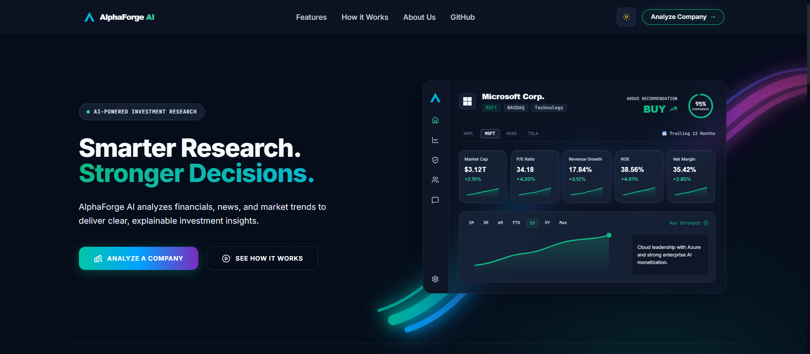
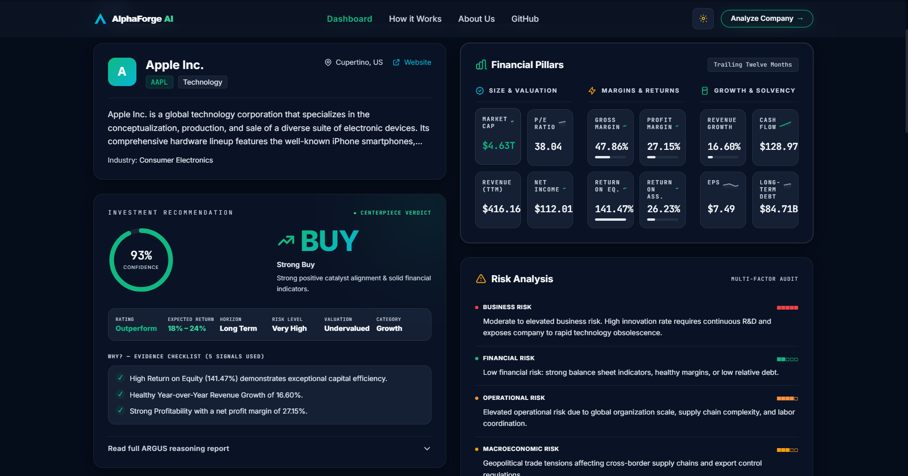
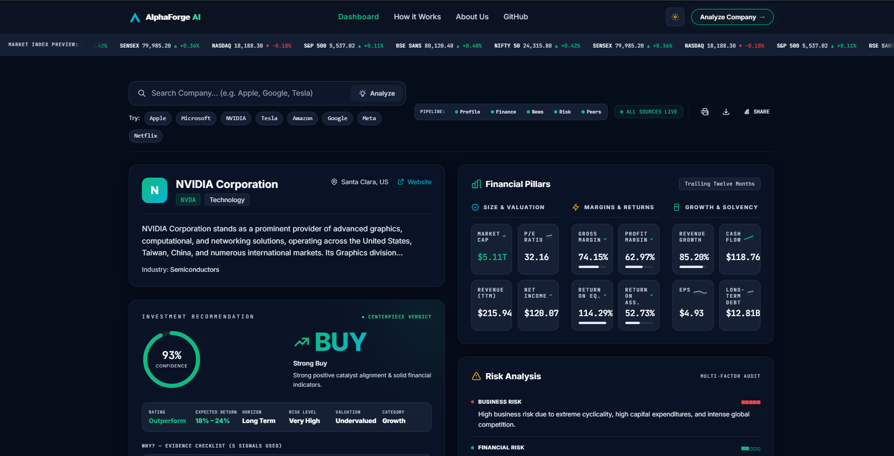
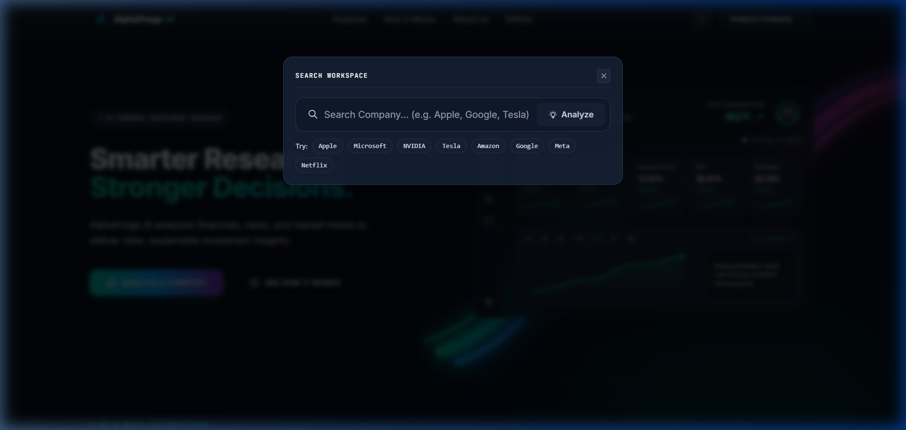
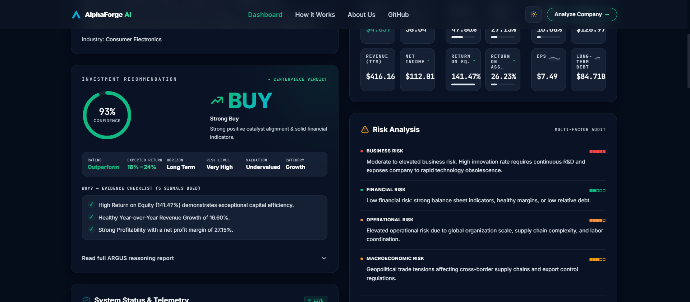
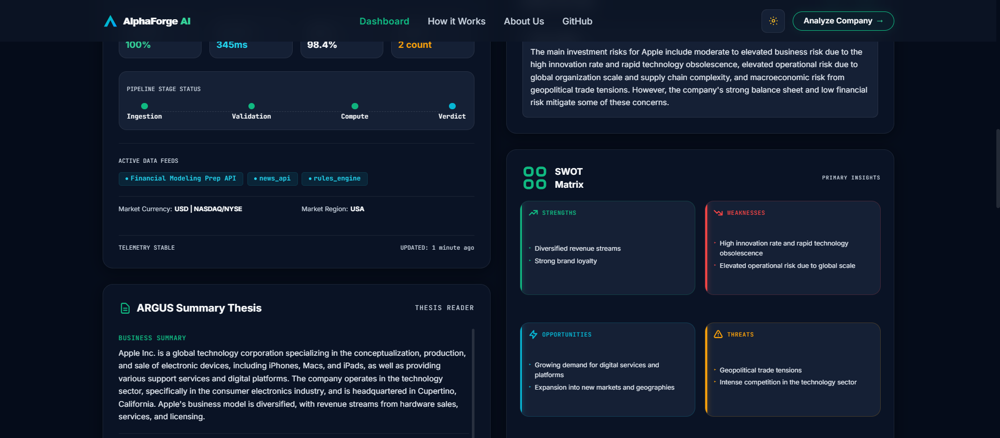
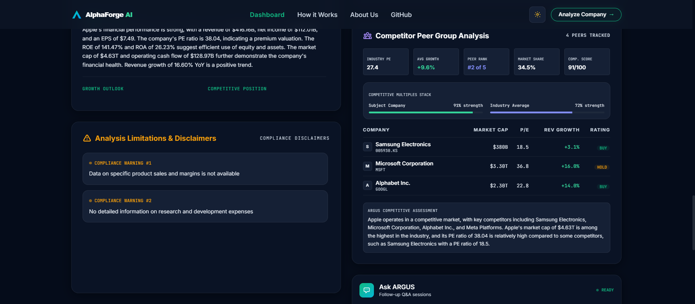
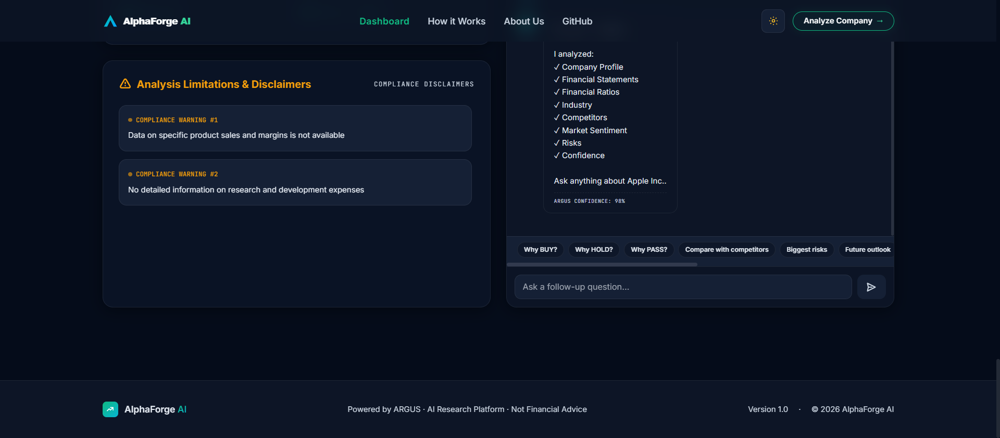

# AlphaForge AI
### Explainable AI Investment Research Platform

AlphaForge AI is an institutional-grade investment research platform designed to expose the reasoning behind automated financial recommendations.

---

## Overview

### What is AlphaForge AI?
AlphaForge AI is a visual investment workspace that queries live financial feeds, news sentiment, and competitor benchmarks to generate explainable BUY, HOLD, or PASS ratings.

### Who is it for?
Built for retail investors, quantitative analysts, and portfolio managers who require auditable and verifiable data rather than black-box AI suggestions.

### Problem Statement
Standard AI advisory tools provide stock recommendations without exposing their source calculations, leading to trust issues and financial hallucinations.

### The Solution
**ARGUS**, a structured research orchestrator, processes company metrics through parallel data tools, validates outputs using strict schema parsing (Zod), and traces every insight to primary sources.

---

## Features
- **Company Analysis**: Comprehensive corporate profile matching and fuzzy ticker resolution.
- **Financial Analysis**: Interactive financial statements and key profitability margins.
- **Financial Ratios**: Live size, valuation, return, and stability metrics.
- **Risk Analysis**: Multi-factor risks (Business, Financial, Operational) mapped to metrics.
- **SWOT Matrix**: Baseline-aligned matrix providing 2 concise points per quadrant.
- **Competitor Analysis**: Peer group benchmarking table comparing ratios.
- **News Sentiment**: Chronological timeline displaying article sentiment levels.
- **Confidence Engine**: Mathematical alignment scoring representing evidence strength.
- **Explainability**: Citation tags linking AI conclusions directly to source data.
- **Provider Routing**: Dynamic dispatch support for both Indian and Global exchanges.
- **ARGUS Assistant**: Real-time Q&A interface for interactive auditing.

---

## Technology Stack

| Layer | Framework / Technology | Purpose |
| :--- | :--- | :--- |
| **Frontend** | React (Vite) | Main client interface |
| **Styling** | Vanilla CSS + Tailwind | Premium glassmorphism dark-theme layout |
| **Backend** | Node.js + Express | API hosting, middleware routing, and caching |
| **AI Layer** | LangChain + Gemini 2.5 | Multi-tool pipeline reasoning and text generation |
| **APIs** | Yahoo Finance, NewsAPI, FMP | Financial statements, peer benchmarking, and articles |

---

## Architecture Flow

```text
React Client (Dashboard)
       │
       ▼
Express API Gateway
       │
       ▼
ARGUS Orchestrator
       │
       ├── Company Resolver (Normalize and fuzzy match queries)
       ├── Market Resolver (Identify exchange: Domestic vs. Global)
       ├── Provider Router (Pick optimal data endpoint)
       ├── Parallel Research Tools (Concurrently query Finance, News, Risk, Competitor APIs)
       ├── Prompt Builder & Gemini (Synthesize report parameters)
       └── Zod Schema Validator & Confidence Engine (Verify JSON output)
```

---

## How It Works

1.  **User Search**: Input is mapped via the `CompanyResolver` and classified by the `MarketResolver`.
2.  **Provider Routing**: Optimal data endpoints are selected by `ProviderRouter` based on exchange rules.
3.  **Parallel Gathering**: Finance, News, Risk, and Competitor APIs are queried concurrently.
4.  **Synthesis**: Raw data is compiled into prompts and parsed by the primary/fallback LLM engines.
5.  **Verification**: Outputs are schema-validated using Zod, scored by the `ConfidenceEngine`, and mounted to the dashboard.

---

## How to run it

### Prerequisites
- Node.js (v18.0.0 or higher)
- npm (v9.0.0 or higher)

### 1. Clone the Repository
```bash
git clone https://github.com/yourusername/AlphaForge-AI.git
cd AlphaForge-AI
```

### 2. Configure Environment Variables
Copy `.env.example` at the root directory to `backend/.env` and `frontend/.env` respectively:
```bash
cp .env.example backend/.env
cp frontend/.env.example frontend/.env
```
Fill in the API keys in your `backend/.env` file.

### 3. Install Dependencies
```bash
# Install backend packages
cd backend
npm install

# Install frontend packages
cd ../frontend
npm install
```

### 4. Run the Project
```bash
# In backend directory:
npm run dev

# In frontend directory:
npm run dev
```

---

## Environment Variables Configuration

The following keys are defined in your `backend/.env`:
*   `GEMINI_API_KEY`: API key for Gemini 2.5 model reasoning (Required).
*   `ALPHA_VANTAGE_API_KEY`: Key to fetch global stock statements and metrics.
*   `NEWS_API_KEY`: Key for news article sentiment analysis.
*   `FMP_API_KEY`: Optional fallback key for competitor profiling.

---

## Folder Structure

```text
AlphaForge-AI/
├── backend/                  # API Server & AI Orchestrator
│   ├── src/
│   │   ├── controllers/      # Route execution controllers
│   │   ├── routes/           # REST endpoints
│   │   └── intelligence/     # Company mapping & resolver layer
├── frontend/                 # Client Interface
│   ├── src/
│   │   ├── components/       # Reusable layout cards
│   │   └── pages/            # Landing and Dashboard pages
└── docs/                     # Technical and system manuals
```

---

## Key decisions & trade-offs

### Key Decisions
- **React/Vite**: Fast, reactive state mounts and minimal hot-reload delays.
- **Express**: Sturdy REST routing middleware and simple session logging controls.
- **Gemini Primary with Fallbacks**: Low latency primary response times, with OpenAI and Groq fallbacks for reliability.
- **Zod Schema Validations**: Type-safety checks to prevent model output syntax corruptions.
- **BUY / HOLD / PASS**: Shifted from Buy/Sell indicators to focus on research recommendation rather than trade execution.

### Trade-offs (What we chose to leave out)
- **Authentication**: Excluded to focus on report processing speed and session safety.
- **Portfolio Tracking**: Excluded to center structural designs around research discovery rather than trading ledgers.

---

## What we would improve with more time
- **Portfolio Watchlists**: Local storage-based ticker tracking grids.
- **PDF/CSV Downloads**: Single-click export functions for financial statements.
- **RAG over Annual Filings**: Direct vector search on 10-K and 10-Q reports.

---

# Example Runs

AlphaForge AI has been comprehensively evaluated across multiple companies from both the US and Indian equity markets.

| Company | Recommendation | Confidence | Report Link |
| :--- | :--- | :--- | :--- |
| **Apple (AAPL)** | BUY | 93% | [docs/example-runs/AAPL.md](file:///d:/Projects/AlphaForge%20AI/AlphaForge-AI/docs/example-runs/AAPL.md) |
| **Microsoft (MSFT)** | HOLD | 93% | [docs/example-runs/MSFT.md](file:///d:/Projects/AlphaForge%20AI/AlphaForge-AI/docs/example-runs/MSFT.md) |
| **NVIDIA (NVDA)** | BUY | 93% | [docs/example-runs/NVDA.md](file:///d:/Projects/AlphaForge%20AI/AlphaForge-AI/docs/example-runs/NVDA.md) |
| **Tata Consultancy Services (TCS)** | BUY | 89% | [docs/example-runs/TCS.md](file:///d:/Projects/AlphaForge%20AI/AlphaForge-AI/docs/example-runs/TCS.md) |
| **Paytm (PAYTM)** | PASS | 80% | [docs/example-runs/PAYTM.md](file:///d:/Projects/AlphaForge%20AI/AlphaForge-AI/docs/example-runs/PAYTM.md) |
| **Sonata Software (SONATACO)** | HOLD | 65% | [docs/example-runs/SONATA.md](file:///d:/Projects/AlphaForge%20AI/AlphaForge-AI/docs/example-runs/SONATA.md) |

Every generated analysis report includes:
- **Executive Summary**: Core metrics, exchange codes, and expectations.
- **Financial Analysis**: Margin ratios and balance sheet indicators.
- **Risk Assessment**: Matrix scoring for corporate vulnerabilities.
- **SWOT Matrix**: Two highly concentrated points per quadrant.
- **Competitor Analysis**: Relative positioning compared to peer group benchmarks.

---

# Screenshots

The following screenshots illustrate the interface, layout architecture, and reasoning components in AlphaForge AI:

## Landing Page

*Displays the dark-mode layout of the terminal workspace, including the dynamic company preview card carousel.*

## Apple Investment Report

*Shows the asymmetric cockpit dashboard displaying the company profile summary, recommendation panel, and financial pillars for Apple.*

## Nvidia Investment Report

*Shows the full quantitative analysis and dashboard report generated for NVIDIA.*

## Investment Recommendation Centerpiece

*Provides details on rating categorization, expected return percentages, evidence metrics checklist, and the circular confidence score dial.*

## Risk Analysis Card

*Visualizes business, financial, operational, and macroeconomic risk categories with rating levels.*

## SWOT Matrix

*Aligns strengths, weaknesses, opportunities, and threats inside a fixed-height baseline-constrained grid.*

## Competitor Peer Group Analysis

*Details relative margins, P/E multiples, revenue growth rates, and market share across primary sector peers.*

## Ask ARGUS Assistant

*Shows the interactive follow-up Q&A window with data source citations.*

---

# Documentation

The `docs/` directory contains structured technical documentation explaining the system design:
- [docs/example-runs/](file:///d:/Projects/AlphaForge%20AI/AlphaForge-AI/docs/example-runs/): Pre-generated stock research reports containing investment checklists.
- [docs/screenshots/](file:///d:/Projects/AlphaForge%20AI/AlphaForge-AI/docs/screenshots/): Layout screenshots displaying the interactive UI modules.
- [docs/Architecture.md](file:///d:/Projects/AlphaForge%20AI/AlphaForge-AI/docs/Architecture.md): System design, boundaries, and asymmetric grids.
- [docs/decisions/](file:///d:/Projects/AlphaForge%20AI/AlphaForge-AI/docs/decisions/): Architectural decision records (ADRs) explaining technology choices.
- [docs/llm-transcripts/development-log.md](file:///d:/Projects/AlphaForge%20AI/AlphaForge-AI/docs/llm-transcripts/development-log.md): AI-assisted prompt iterations and engineering development log.
- [docs/llm-transcripts/transcript.jsonl](file:///d:/Projects/AlphaForge%20AI/AlphaForge-AI/docs/llm-transcripts/transcript.jsonl): Complete raw conversation transcript logs of the AI-assisted pair programming sessions.

