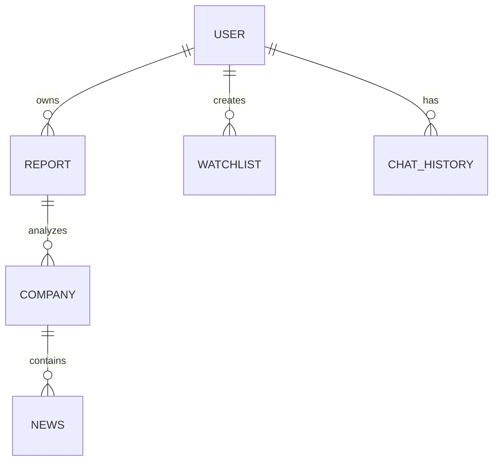

# Database Design

> **Version 1.0 Note**
>
> AlphaForge AI Version 1.0 is intentionally designed to operate without requiring a persistent database.
>
> The architecture, however, is prepared for future database integration.

---

# Purpose

The database stores persistent user and system information.

The AI reasoning pipeline must never depend on the database.

The application should continue functioning even if the database becomes temporarily unavailable.

---

# Database Philosophy

Database stores

✓ Users

✓ Sessions

✓ Reports

✓ Chat History

✓ Saved Companies

✓ Watchlists

Database DOES NOT store

✗ AI Reasoning

✗ Prompt Construction

✗ Tool Execution

✗ Live API Responses

Those should always be generated dynamically.

---

# Future Database

Recommended

PostgreSQL

Reason

- ACID Compliance

- Mature Ecosystem

- Excellent Node.js Support

- Scalability

---

# Entity Relationship Diagram

---

# User

Fields

id

name

email

passwordHash

createdAt

updatedAt

---

# Report

Fields

id

userId

company

recommendation

confidence

createdAt

---

# Chat History

Fields

id

reportId

question

answer

timestamp

---

# Watchlist

Fields

id

userId

company

createdAt

---

# Future Scope

Portfolio

Transactions

Alerts

Notifications

Agent Memory