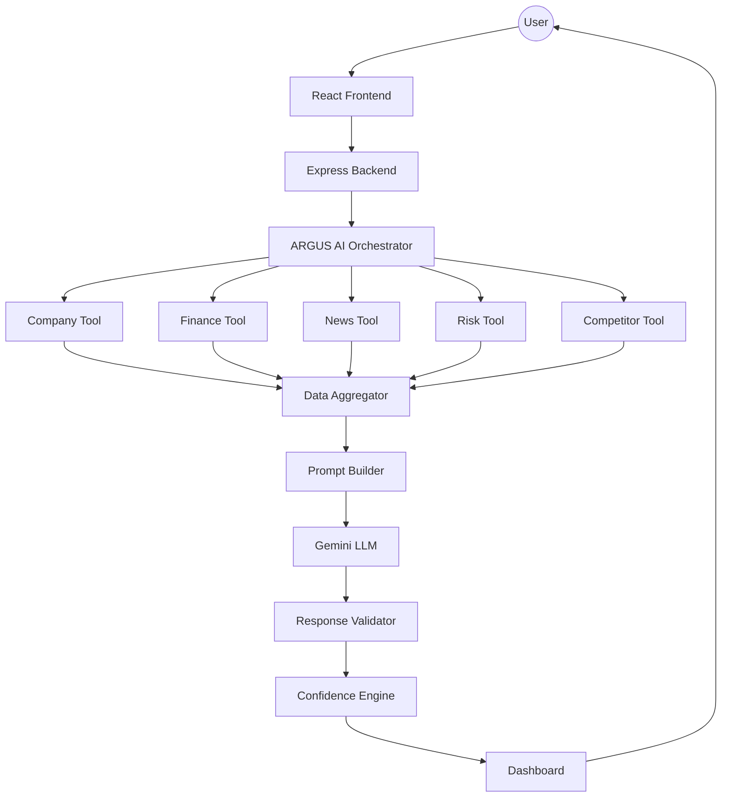

# High-Level Architecture

---

## Design Principles

- Frontend never communicates with Gemini.

- Backend is the only AI gateway.

- Every external request flows through ARGUS.

- Tools never communicate with one another.

- Gemini is invoked exactly once per analysis.